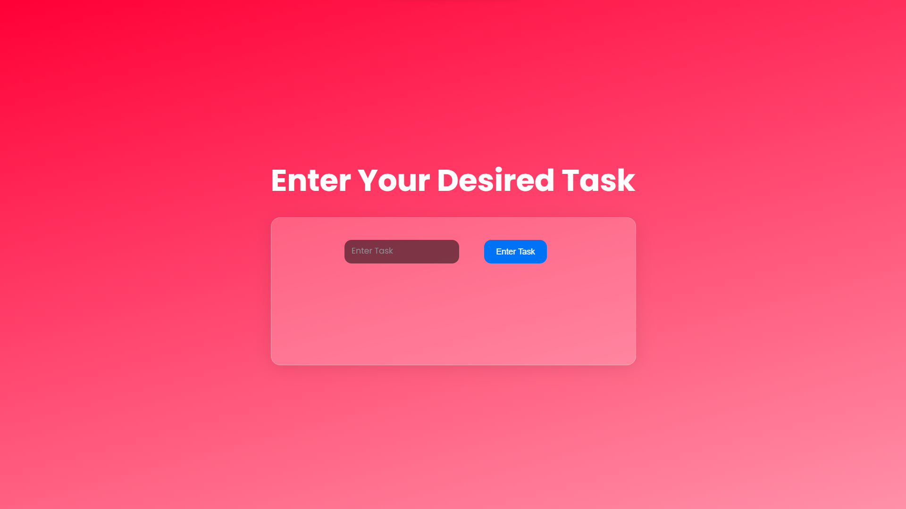
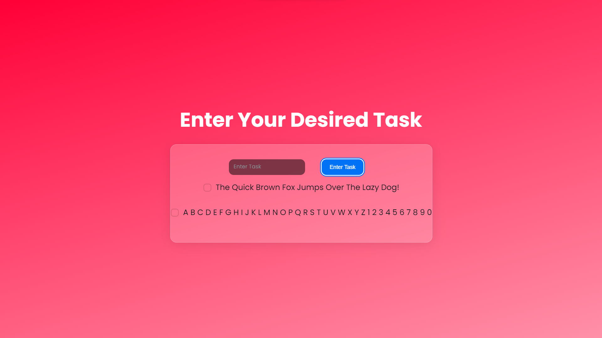
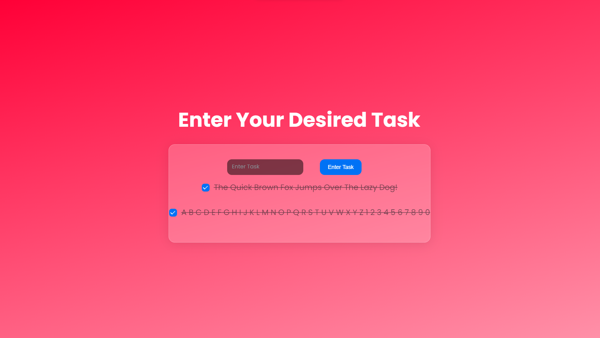

# Task Management App

This is a simple task management application built with React and NextUI. It allows users to input tasks and keep track of them.

## How it Works

The application consists of two main components: `App` and `Form`. The `App` component renders a title and the `Form` component. The `Form` component includes an input field where the user can type in a task and a button to submit it. 

Once the user submits a task, the task is stored in an array using the `useState` hook. The `handleChange` function updates the `currentMessage` state with the contents of the input field as the user types. The `keyboardEventModifier` function checks for the Enter key press and updates the `todoMessage` state with the new task added. 

The `Form` component also renders the list of tasks added to the `todoMessage` state, with a line-through styling using the `Checkbox` component from NextUI.

## How to Use

To use this application, simply clone the repository and run `npm install`, then run `npm run dev`. You can then add tasks using the input field and submit button, and they will appear on the page. 

Note that tasks cannot be added if the input field is blank. If you attempt to submit a blank task, an error message will be logged to the console.

## Images of Display

 

 

## Credits

This application was created by [LarryTheCat](https://www.github.com/larrythefatcat). 

## License

This project is licensed under the MIT License - see the [LICENSE.md](LICENSE) file for details.
